# 🌱 GreenDot — AI-Driven Agricultural Intelligence

<div align="center">


<strong>Empowering Farmers with AI-Driven Agricultural Intelligence</strong>

[](https://flutter.dev)
[](https://dart.dev)
[](https://firebase.google.com)
[](https://www.tensorflow.org/lite)
[](LICENSE)
[](.github/CONTRIBUTING.md)
[](https://github.com/Keerthanreddy01/Greendot/actions/workflows/flutter.yml)
[](https://github.com/Keerthanreddy01/Greendot/actions/workflows/secret-scan.yml)
[](https://github.com/Keerthanreddy01/Greendot/actions/workflows/release-apk.yml)

[📘 Features](#-core-features) • [🧩 Architecture](#-architecture--system-design) • [🧠 AI Workflow](#-ai--ml-integration-pipeline) • [🚀 Setup](#-installation--setup) • [🧪 Testing](#-testing) • [👥 Policies](#-community--policies) • [🗺️ Roadmap](#-roadmap)

</div>

---

## 📖 Overview

GreenDot is an AI-powered agricultural platform that helps farmers detect plant diseases, manage farms intelligently, and make data‑driven decisions — all through a multilingual Flutter app.

> 🌾 Vision: Empower every farmer with accessible technology that increases productivity, reduces losses, and fosters sustainable agriculture.

---

## ✨ Core Features

| Feature | Description |
|--------|-------------|
| 🤖 AI-Powered Disease Detection | Capture plant images → Identify disease → Get treatment advice instantly. |
| 📊 Smart Farm Dashboard | Weather, soil, and crop status with intelligent insights. |
| 💰 Market Intelligence | Live crop price feeds from Telangana’s key markets with trend arrows (↑/↓). |
| 📋 Task & Schedule Management | Time-based tasks, reminders, and progress celebrations 🎉. |
| 🔔 Advanced Alerts | Two-tier alerting for weather, pest, and water-related warnings. |
| 🌍 Multilingual (13 languages) | English, Hindi, Telugu, Tamil, Kannada, Malayalam, Marathi, Gujarati, Bengali, Punjabi, Odia, Assamese. |

---

## 🏗️ Architecture & System Design

### High-Level Overview

```mermaid
flowchart TD
  A["📱 Farmer (App)"] --> B["🤖 AI/ML Disease Detection"]
  A --> C["🌦️ Weather & Market APIs"]
  A --> D["📊 Farm Management Module"]
  B --> E["☁️ Firebase / Backend"]
  C --> E
  D --> E
  E --> F["📈 Analytics Dashboard"]
  F --> A
```



💡 Built for scalability, modularity, offline-first resilience.

### Project Structure (key folders)

```text
lib/
├─ main.dart
├─ screens/
│  ├─ splash_screen.dart
│  ├─ language_selection_screen.dart
│  ├─ home_screen.dart
│  ├─ camera_scanner_screen.dart
│  ├─ market_prices_screen.dart
│  ├─ scan_result_screen.dart
│  └─ voice_assistant_screen.dart
├─ providers/
├─ services/
├─ models/
├─ widgets/
├─ features/
└─ localization/
```

---

## 🧠 AI & ML Integration Pipeline

```mermaid
graph TD
  A["📷 Capture Image"] --> B["🧮 Preprocess (resize, normalize)"]
  B --> C["🧠 TFLite Inference"]
  C --> D["📋 Prediction (Disease + Confidence)"]
  D --> E["💊 Treatment Recommendation"]
  E --> F["🗣️ Localized Output"]
```



- Model: Custom TensorFlow Lite CNN trained on Indian crop datasets
- Offline Mode: Fully local inference with TFLite
- Future: Optional cloud model updates via Firebase ML

---

## 🧭 Tech Stack

| Layer | Technology |
|------|------------|
| Frontend | Flutter (Dart ≥ 3.0.0) |
| State Management | Provider, ChangeNotifier, Flutter BLoC |
| AI Engine | TensorFlow Lite via `tflite_flutter` |
| Backend / DB | Firebase (Core, Auth, Firestore, Storage) + REST APIs |
| Notifications | Local notifications |
| Storage | SharedPreferences, Cloud Firestore |
| Media & Sensors | Camera, Image Picker, Permission Handler |
| Voice | speech_to_text, flutter_tts |
| Charts | fl_chart |

---

## 🚀 Installation & Setup

### Prerequisites
- Flutter SDK ≥ 3.0
- Dart SDK ≥ 3.0 (repo targets `sdk: ">=3.0.0 <4.0.0"`)
- Android Studio or VS Code
- Optional: Firebase project for Auth/Storage/Firestore features

### 1) Clone

```powershell
git clone https://github.com/<your-username>/greendot.git
cd greendot
```

### 2) Install dependencies

```powershell
flutter pub get
```

### 3) Configure Firebase (optional but recommended)

- Android: place `google-services.json` in `android/app/` (already referenced)
- iOS: place `GoogleService-Info.plist` in `ios/Runner/`
- FlutterFire recommended: generate `lib/firebase_options.dart` (already present)
  
  IMPORTANT: This repository has been sanitized for public/hackathon sharing.
  - All real Firebase configuration values and service files have been removed or redacted.
  - `lib/firebase_options.dart` contains placeholders. Run `flutterfire configure` locally to recreate your own config.
  - Do NOT commit sensitive files like `android/app/google-services.json`, `ios/Runner/GoogleService-Info.plist`, or any private keys.

### 4) Run the app

```powershell
flutter run
```

### 5) Build release APK (optional)

```powershell
flutter build apk --release
```

---

## 🔧 Configuration

If you manage custom settings, create a `.env` or use constants and set values like:

```text
API_BASE_URL=https://api.greendot.io
FIREBASE_PROJECT_ID=<your-firebase-project-id>
TFLITE_MODEL_PATH=assets/model.tflite
```

Also ensure the TFLite model is placed in `assets/` and referenced in `pubspec.yaml`.

---

## 🌐 Localization

- App supports 13 languages; ensure locale ARB files or translation maps are kept in `lib/localization/`.
- Use Flutter localization (`flutter_localizations`) and device locale detection.
- Add new languages by providing translations and updating supported locales.

---

## 🧪 Testing

Basic widget tests live in `test/`. Run:

```powershell
flutter test
```

Recommended: add tests for
- Disease detection flow (mocking TFLite)
- Localization fallback
- Market prices API parser

---

## 📸 Screenshots

Add screenshots to `assets/screenshots/` and reference them here:

| Splash | Home | Scan |
|---|---|---|
|  |  |  |

---

## 🛣️ Roadmap

| Stage | Features | Status |
|------|----------|--------|
| ✅ Phase 1 | UI/UX, Language Support, Market Module | Completed |
| 🔄 Phase 2 | Camera + TFLite Model, Notifications | In Progress |
| 🎯 Phase 3 | Cloud Sync, Authentication, Expert Consults | Planned |
| 🚀 Phase 4 | Community Hub, Crop Yield Prediction | Upcoming |

---

## 🧑‍🤝‍🧑 Community & Policies

- Read our [Code of Conduct](.github/CODE_OF_CONDUCT.md)
- See how to [Contribute](.github/CONTRIBUTING.md)
- Report sensitive issues via [Security Policy](.github/SECURITY.md)
- Get help in [Support](.github/SUPPORT.md)

---

## 🤝 Contributing

We welcome contributions from developers, agronomists, and AI researchers.

1. Fork this repository
2. Create a branch: `git checkout -b feature/your-feature`
3. Commit: `git commit -m "feat: add your feature"`
4. Push: `git push origin feature/your-feature`
5. Open a Pull Request

Please read [CONTRIBUTING.md](.github/CONTRIBUTING.md) and follow the commit style and PR checklist.

---

## 🔐 License

This project is currently released under an “All Rights Reserved” license. See [LICENSE](LICENSE) for terms.

Note: If you intend to switch to an open-source license (e.g., MIT), update `LICENSE` and the license badge in this README accordingly.

---

## 👥 Team & Contact

| Role | Name |
|------|------|
| 👨‍💻 Project Lead | Keerthan Reddy |

Contact
- For privacy, direct contact details have been removed from this public copy.
- Issues: open a ticket via GitHub Issues
- Discussions: start a thread in the Discussions tab

---

<div align="center">

Made with ❤️ & AI for Farmers  
⭐ If this project resonates with you, please consider leaving a star.

